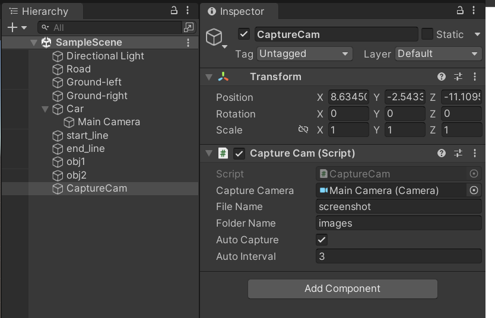

# Unity Simple Car Game
## Functions
1. Control Movement
    - awsd: left,forward,backward,right
2. Capture Camera View
    - Check `Auto Capture`: Set the `autointerval`, which means it will take a screenshot every `autointerval` second.
    - Uncheck `Auto Capture`: Manually press `p` to take a screenshot
    - `FolderName`: Set the screenshot should be saved in where, the defualt path is `the project path\FolderName\` 
    
3. Restart \
    You should set the tag of the object, the car will automatically detect whether there are `collision` or `out of bound`.
    - OutOfBound
    - Road
    - Obticle